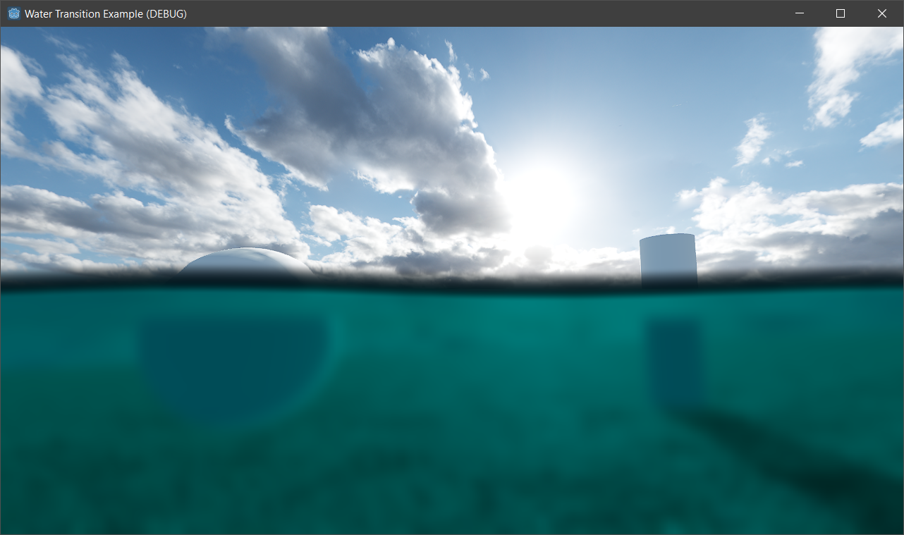

# Water Transition Example

This example project demonstrates the water transition shader from my "Drone Simulator" prototype project made in Godot Engine 3.5+. Also see my YouTube playlist for update videos: https://youtube.com/playlist?list=PLB0a9ZaCofXPzLFlA6gbKrDyfETi8pO1b.

All required code is rewritten in GDScript for this project (instead of C++). A simple first person character is provided to walk around and dive into the water.

## Controls

| Input         | Description               |
|---------------|---------------------------|
| W/A/S/D       | Mode player character.    |
| Mouse         | Look around.              |
| Escape Key    | Exit game.                |
| Alt + Enter   | Toggle fullscreen mode.   |

## Technical Description
For this implementation I use a Viewport inside the **Player.tscn** scene to draw the water transition texture - or "clip plane" - onto the mesh in front of the viewport's camera. This texture is later used by the post processing overlay panel node (**PostProcessingOverlay**) inside the main scene (**WaterLevel.tscn**) to render the split between the water surface and the underwater color - the actual water transition effect shader.

This extra step is required to have access to the camera's transform data and matrices on a per-fragment basis inside the shader code. Also, unfortunately the texture behind the SCREEN_TEXTURE built-in variable does not include "the shaded" transparency pass of the water surface from the water plane mesh at this stage. Both materials use the same "raw" screen texture result.

I also make use of cull masks here for the cameras and the render target mesh. Layer 16 is being used for the water transition pass.

For performance optimization, all affected nodes for the water transition effect get hidden when above the water surface.

If you're familiar with RenderDoc (https://renderdoc.org), feel free to inspect Godot's rendering architecture in more detail by analyzing this project. It's fun!

I'm quite sure there's a somewhat smarter and/or a more performant solution. Just feel free to contact me on Twitter (https://twitter.com/bifractal) if you have any questions or ideas ✌
